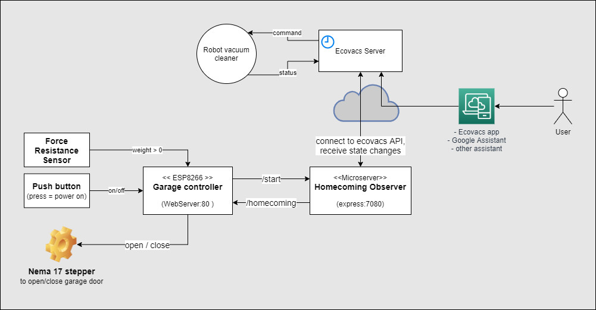

# Automated robot vacuum cleaner garage

## Description

The robot controlls it all! 100% automation, no manual interactions, invisible installation.

The robot leaves the charging station and operates a mechanical switch that turns on the power. The software opens the door immediately, waits 30 sec to give the robot enough time to leave the garage and then closes the door.

On return it sends an event to the manufactor's server. The software listens to this event, sets the garage into homecoming mode, opens the door and waits for the robot to arrive. A thin force sensing resistor, placed a few centimeteres in front of the charging station, notices when the robot overruns it. That gives the signal to close the garage door right before the power is switched off again.

If the robot didn't return within 5 minutes it is assumed to be trapped and the door gets lowered again. Remove the barriers, say `hey google, return my robot to charging dock` and both robot and garage door execute the homecoming command.

***

## Videos

Robot vacuum cleaner leaves the docking station. 

[](https://www.youtube.com/watch?v=2y_Sdoj8P9I "Automated robot vacuum cleaner garage - start cleaning")

The robot returns to the charging station. The ESP received the homecoming event, opened the door and waits for the robot to run over the force resistance sensor.

[](https://www.youtube.com/watch?v=6Qcx_HnqS7c "Automated robot vacuum cleaner garage - returning home")

The kitchen skirting board is heavy, a regular nema 17 cannot lift or hold it. Thus it needs a gearing mechanism. Lucky you if you have a 3D printer at home.

[](https://www.youtube.com/watch?v=Ibu8yQTSDAc "Automated robot vacuum cleaner garage - returning home")

***

## How it works



The ESP8266 operates a nema 17 stepper motor that lifts the kitchen skirting board up and down. As long as the robot is in parking postion, one of the robot's wheels stand on an inverted push button so the ESP is powered off. The power is turned on when the robot starts leaving the docking station. On startup the controller executes the following startup routine:

```C++
void setup(){
  Serial.begin(9600);

  // stepper pins
  pinMode(enablePin, OUTPUT);
  pinMode(stepPin, OUTPUT);
  pinMode(dirPin, OUTPUT);

  // force resistance pin
  pinMode(frsPin, INPUT);

  openDoorWaitAndClose(); // function waits 30 sec before closing the door again
 
  // connect to home WiFi
  WiFi.mode(WIFI_STA);
  WiFi.begin(ssid, password);
  Serial.print("Attempting to connect to WPA ");
  Serial.println(ssid);
  if (WiFi.waitForConnectResult() != WL_CONNECTED) {
    Serial.println("WiFi failed!");
    return;
  }
  Serial.println("connected");
  Serial.println(WiFi.localIP());

  // register API endpoints on ESP8266WebServer
  server.on("/open", handleOpenDoor); // for test usage
  server.on("/close", handleCloseDoor); // for test usage
  server.on("/homecoming", handleHomecoming); // for use by nodejs server
  server.onNotFound(handleNotFound); 
  server.begin();
  Serial.println("HTTP server started");

  // send signal to nodejs server
  wakeupBackendService();
}
```
The nodejs server opens a connection to the Ecovacs REST API and starts to listens for inbound status notification events. If the "returning" event is received, the program forwards the event via http to the ESP8266WebServer.

```js
const observe = async () => {
    if (vacbot !== undefined) {
        console.log('Already observing')
        return
    }
    console.log('Start observing')

    const connectStatus = await api.connect(username, passwordHash)
    const devices = await api.devices()
    let vacuum = devices[0];
    vacbot = api.getVacBot(api.uid, EcoVacsAPI.REALM, api.resource, api.user_access_token, vacuum, continent)

    vacbot.on('ready', async (event) => {
        console.log('Vacbot ready')

        vacbot.on('CleanReport', async (state) => {
            console.log('CleanReport: ' + state)

            if (state === 'returning') {
                disconnect()
                vacbot = undefined

                console.log('Try open garage door')
                var response = await openGarage()
                console.log('Garage door opens...')

                let i = 0
                while (response !== 200 && i < 5) {
                    i++;
                    console.log(`Error ${response}, retry open garage door #${i}`)
                    response = await openGarage()
                    await sleep(500)
                }
            }
        })
    })

    process.on('SIGINT', function () {
        console.log("\nGracefully shutting down from SIGINT (Ctrl+C)")
        disconnect()
        process.exit()
    });

    function disconnect() {
        try {
            vacbot.disconnect();
        } catch (e) {
            console.log('Failure disconnecting: ', e.message)
        }
    }
}
```

The ESP is now set into homecoming mode. The homecoming function waits for the robot to run over the force sensing resistor, that is placed right in front of charging station, and closes the door in the final moment before the system is powered off again.

```C++
void homecoming(){
  openDoor();
  do {
    frsValue = analogRead(frsPin);
    delay(500);
  } while (frsValue == 0); // wait for force resistance sensor signal, the quickly close the door before the power is turned off
  closeDoor();
}
```

***

## Build instructions

### NodeMCU, motor and force sensitive resistor wiring

My circuit is run by a single 12V 5A power supply. A  L298N H-Bridge that I had in spare converts 12V in 5V and provides this as input to the ESP8266. This allows me to easily switch on/off the ESP8266 and the stepper driver by a push button. 

In my first experiments I used the L298N to operate the Nema 17 stepper. That wasn't a good idea. I burned my ESP8266 when I performed a physical load test  to figure out how much kilogram the motor (and driver) is able to lift and hold. So I read a bit about stepper drivers other guys use and gave it a try with the A9488 stepper driver. Even under stress it works like a charm, in the worst case the stepper overruns a step.

The A9488 has a on-board potentiometer that one can use to adjust voltage for the motor. Default setting was already good but not sufficient, in my case a quater turn in clockwise direction gave the motor enough power to lift my 1 kg kitchen skirting board.

Don't forget the electrolytic capacitor (100 µF) to protect the stepper driver from spikes.


### 3D print the reduction gear

For this reduction gear design I finally did my first steps with OpenSCAD. To get accurate gears I used the MCAD/involute_gears.scad library. For my [previous designs](https://www.thingiverse.com/mika2de/designs) I used FreeCAD which was sort of okish for me, but now that I switched to OpenSCAD there is no going back. The reduction gear source file is available in folder cad-models, modify according to your needs. In addition you might find https://geargenerator.com/ helpful, too. 


### Prepare the kitchen skirting board

Check the following image on how to install the hings on your kitchen skirting board. If the hing is not centered like in the middle picture, your skirting board won't hang in a 90° angle from your cupboard. However, when the hinge is centered and you place your skirting board not directly at the front of cupboard but a few centimeters back, you need a pad to open the garage door completely without being blocked by the bottom of the cupboard. 


Depending on your hinge, you can customize yourself the pad with just a few lines of OpenSCAD code:

```C++
difference() {
    cube([42,11,7]);
    translate([1,0,-0.1]) cube([40,10,1.2]);
    translate([8,5,0]) cylinder(h=20,r=1.5,$fn=20);
    translate([34,5,0]) cylinder(h=20,r=1.5,$fn=20);
}
```

### Run homecoming observer in background

I've a HP microserver running at home, which I reused to host my tiny nodejs homecoming observer program. I installed it in a unix VM and configured it to run after VM startup. 

### Install hardware

Mount the reduction gear to a e.g. wood construction of your choice. If you don't have much space like me, try to position the stepper motor higher at a height that allows the robot vacuum cleaner to drive under it. This gives the robot a bit more space to move. 


The force sensitive resistor's purpose is to give a signal to the ESP8266 to close the door when the robot is back in the garage. Since the circuit will be powered off as soon as the robot wheel stands on the inverted push button you need to place the FSR needs to be placed a few centimeters in front of the push button. This also depends on the speed of your robot. The slower the robot move towards the charging station, the closer you can put the FSR to the push button. If you put it too close to the button, it could happen that the ESP has not enough time to close the door before it is powered off.


## More 

See project log on https://hackaday.io/project/178993-space-saving-automated-robot-vacuum-cleaner-garage